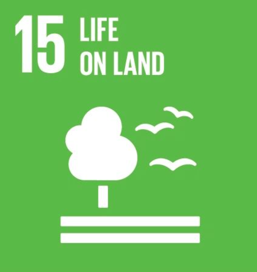
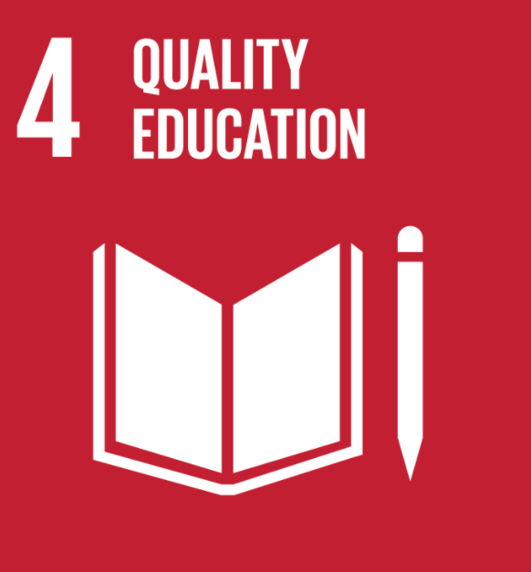
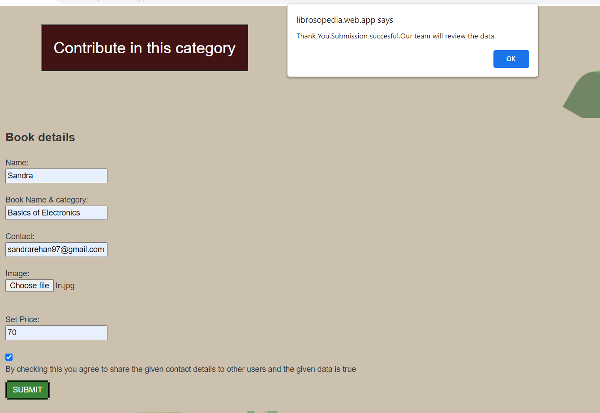

# Librosopedia
A simple web app to swap and contribute used books.
Our project is based on UN SDGs 4 and 15.
We aim to form a community for promoting the reuse of books.Thereby we can save a lot more trees from destruction.
Moreover we think we can support students from developing countries like India by providing books at a lesser rate. 

## The tagline is Read Reuse Repeat

 User can join the community to get/contribute used books.

Everyone can share recycling ideas in our blog , without even joining (Signing Up).

Categorised details of books are available in the library page.

User can easily contribute their used books to others by filling the form.

Books with contributor details are provided on the site. So users can directly contact them. Only the expense for sending the book has to be remitted from the user.

